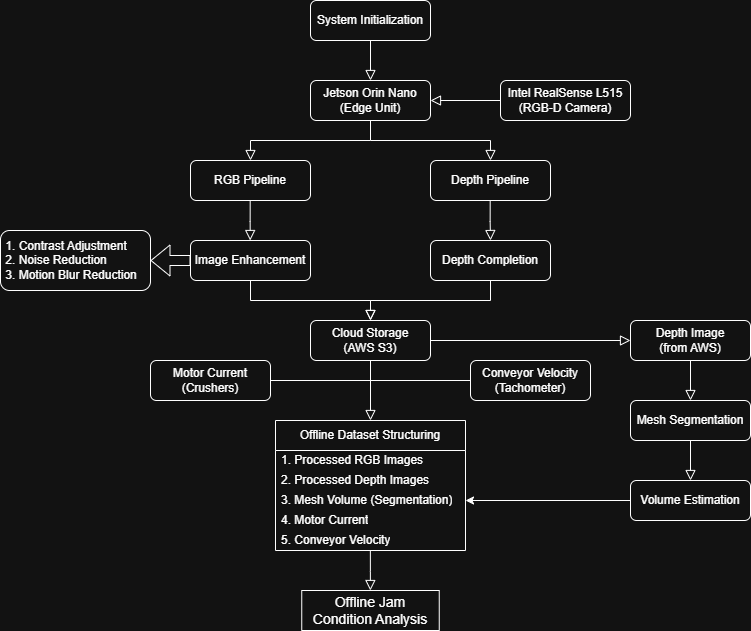

# Industrial Hammer Mill Optimization and Jam Prevention using Multimodal Sensors

## Problem Statement
In industrial operations, hammer mills are critical for material processing. In this system, the hammer mill processes iron mesh to remove rust. However, unexpected jams frequently occur, leading to costly downtime, maintenance delays, and production inefficiencies. These jam events are difficult to predict using conventional monitoring systems, resulting in reactive maintenance and unscheduled shutdowns.

This project addresses the problem by designing and deploying a synchronized multimodal perception and data acquisition system to monitor material flow characteristics and machine load conditions. The objective was to build a robust edge-based sensing architecture capable of capturing and structuring heterogeneous industrial signals for downstream analysis.

## Overview
This project presents the design and deployment of a multimodal industrial monitoring system built on an NVIDIA Jetson Orin Nano. The system integrates RGB-D perception, conveyor velocity sensing, and motor current monitoring into a unified edge-computing pipeline, enabling structured edge-based visual preprocessing and cloud-based multimodal data logging for industrial-scale offline analysis.

Using depth-guided mesh segmentation and frame-wise volume estimation, the pipeline generates structured multimodal datasets by merging visual features with conveyor speed and motor current signals. The complete sensing, synchronization, and logging architecture was deployed and validated under real industrial operating conditions.

## System Architecture
The system follows an edge-based multimodal acquisition and synchronization architecture.

### Components
- NVIDIA Jetson Orin Nano  
- Intel RealSense L515 (RGB-D + point cloud)  
- Tachometer (conveyor belt velocity measurement)  
- Hammer mill & crusher motor current sensors  
- AWS cloud logging  

Visual streams are processed and stored via the Jetson edge unit, while conveyor velocity and motor current are logged independently and aligned during offline dataset integration.

## Data Acquisition
The system captures:
- RGB images (Intel RealSense L515)
- 16-bit depth images (Intel RealSense L515)
- Point cloud data (.ply)  
- Conveyor belt velocity (tachometer)  
- Motor current signals

All modalities are stored with timestamps to enable deterministic alignment during offline dataset integration.

## Processing Workflow

### 1. Image Enhancement
**RGB Processing**
- Color contrast enhancement (CLAHE)
- Noise reduction (NLM)
- Motion blur reduction (Weiner Deconvolution)

**Depth Processing**
- Depth completion via propagation-based filling

### 2. Mesh Segmentation
- Depth-based segmentation of iron mesh
- Extraction of mesh region from background

### 3. Volume Estimation
- Extraction of segmented mesh region  
- Depth-based height profile computation  
- Frame-wise material volume estimation

### 4. Offline Multimodal Dataset Integration
For each synchronized frame:
- Processed RGB Frame
- Processed Depth Frame
- Estimated material volume  
- Conveyor velocity  
- Crusher current

These parameters are merged using timestamps to produce structured datasets suitable for regression-based jam-condition analysis.

*(This phase focused on perception, synchronization, and structured data generation; closed-loop predictive deployment was outside current scope.)*

## Technologies Used
Jetson Orin Nano • Intel RealSense L515 • RGB-D Processing • Depth Completion • Edge Detection • Offline Dataset Integration • Python • OpenCV • AWS S3 • Linux • SSH

## Colab Experiments
📓 Image Processing: [Open Image Processing Notebook](https://colab.research.google.com/drive/1XWoZyhsCpmAs5MtlCFcBB17cX8sed00x?usp=sharing) 
